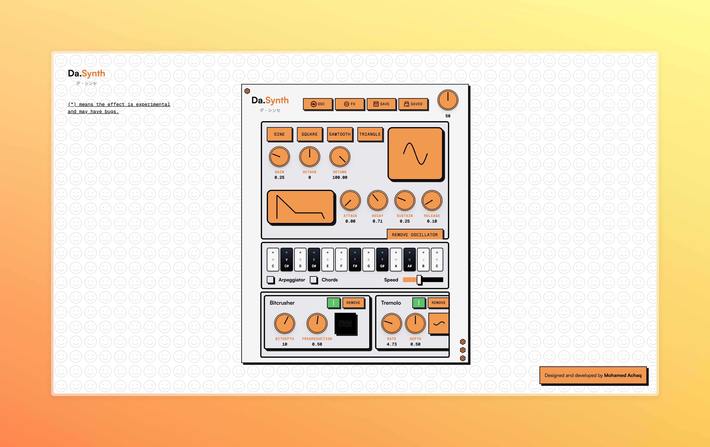

# Da.Synth (ダ・シンセ)

## what's this?
a web-based synth playground.
inspired by quirky hardware.
made for happy accidents.

[play now](https://da-synth.achaq.dev)

⚠️ work in progress. expect weirdness.

## features (so far)
- oscillators (lots)
- effects (more than necessary)
- ui (trying its best)
- presets (save your mistakes)

## coming soon
- everything, but better

## the toybox
### standard tools
1. chorus
2. compressor
3. delay
4. distortion
5. filter
6. flanger
7. limiter
8. phaser
9. reverb
10. stereo widener
11. tremolo

### experimental toys*
12. bitcrusher
13. dimension expander
14. formant filter
15. granular
16. ping pong delay
17. sonic transformer
18. spectral shaper

*might break. that's half the fun.

## how it works
- next.js (web stuff)
- react (knobs and buttons)
- web audio api (bleeps and bloops)
- audio worklets (the magic)

## why?
- to learn
- to play
- to make noise

## can i help?
sure! fork, tinker, break things.
just remember to star ⭐

## fine print
MIT license. use it. learn from it. break it.

---

now go make some noise! 🎶✨
